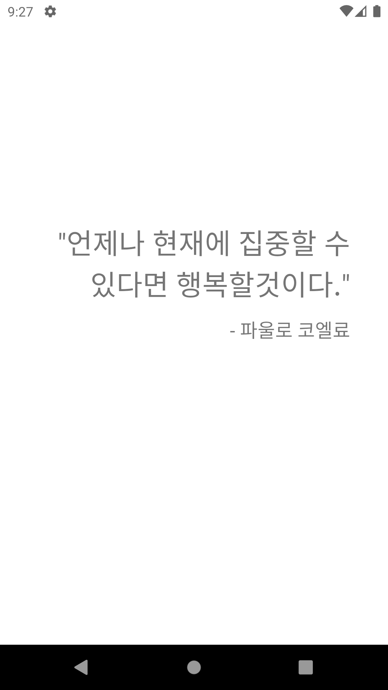
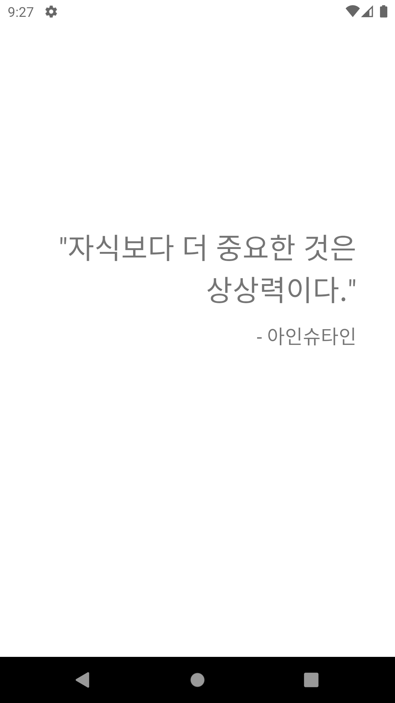

# Android Clone Coding Project #10 오늘의 명언
코드 수정 없이 명언을 추가 가능
 
코드 수정 없이 이름을 숨김 가능
 
무한 스와이프 가능
 

# 결과화면
|Screenshot1|Screenshot2|
|---|---|
|||

 

# 배운 내용 정리
- Firebase
  - Remote Config
- ViewPager2
  - PageTransformer
  - Infinite Swipe
